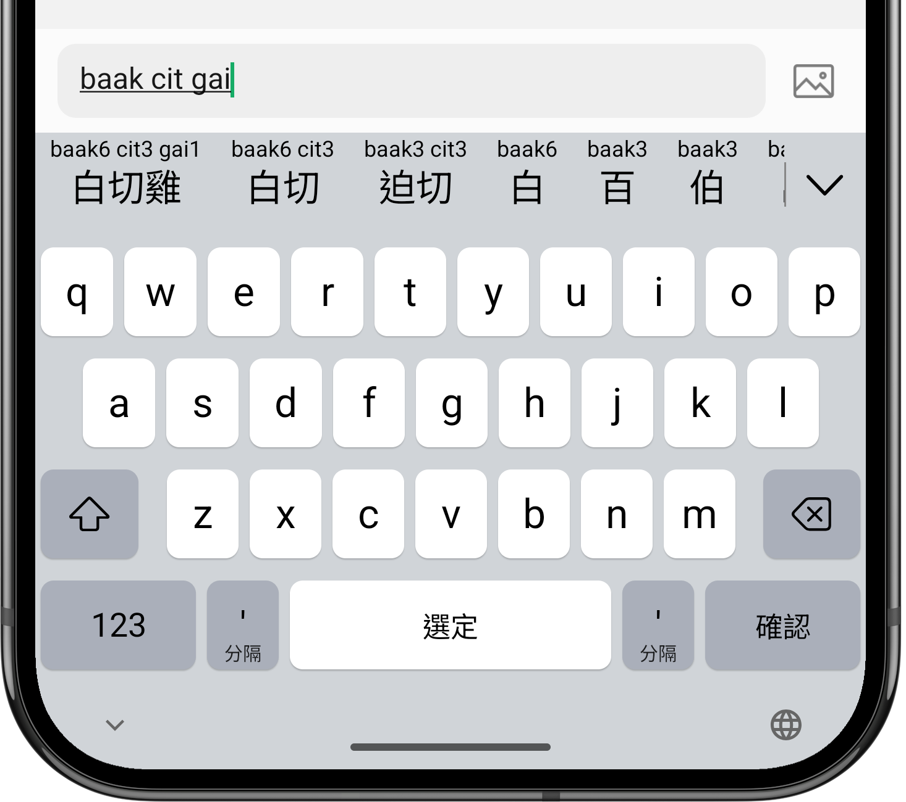

README in [粵語(Cantonese)](README.md) | [普通話(Mandarin)](README-cmn.md)

Jyutping
======

 
 

Cantonese Keyboard for Android adopts the [LSHK Jyutping scheme](https://jyutping.org/jyutping) and supports common habitual spellings.

Feature highlights:
- Full support for Jyutping input.
- Abbreviated input with Jyutping initials.
- Accurate input with Jyutping tones.
- Traditional / Simplified characters.
- Reverse Lookup with Cangjie, Quick(Sucheng), Stroke or Mandarin Pinyin.
- Jyutping hints for candidates.
- Emoji suggestions.
- Easy ways to Copy, Cut, Paste and moving cursor backward/forward.
- Audio and Haptic feedbacks.

Jyutping for iOS & macOS: [yuetyam/jyutping](https://github.com/yuetyam/jyutping)

## Screenshots

## Download

 

 
 
Also available on our website: https://jyutping.app/android

## Credits
- [Rime-Cantonese](https://github.com/rime/rime-cantonese) (Cantonese Lexicon)
- [OpenCC](https://github.com/BYVoid/OpenCC) (Traditional-Simplified Character Conversion)
- [JetBrains](https://www.jetbrains.com/) (Licenses for Open Source Development)

## Thank you for your support
Website: https://jyutping.app/donate

Patreon: https://patreon.com/bingzheung

愛發電: https://afdian.com/a/jyutping

Ko-fi: https://ko-fi.com/zheung

PayPal: https://paypal.me/bingzheung

Bitcoin: `bc1qx5tjmlvq8ydmfzxt5fru7vqq0khjkhf2savheh`

