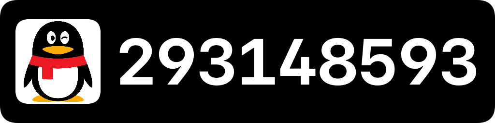

Jyutping
======

(Work in progress | 目前正在開發，即將推出。)
 
 

 
 

Cantonese Keyboard for Android.

粵拼輸入法。採用 [香港語言學學會粵語拼音方案](https://jyutping.org/jyutping) (粵拼 / Jyutping)，兼容各種習慣拼寫串法。

## 擷屏（Screenshots）

## 多謝支持（Support this project）

 

 
 

