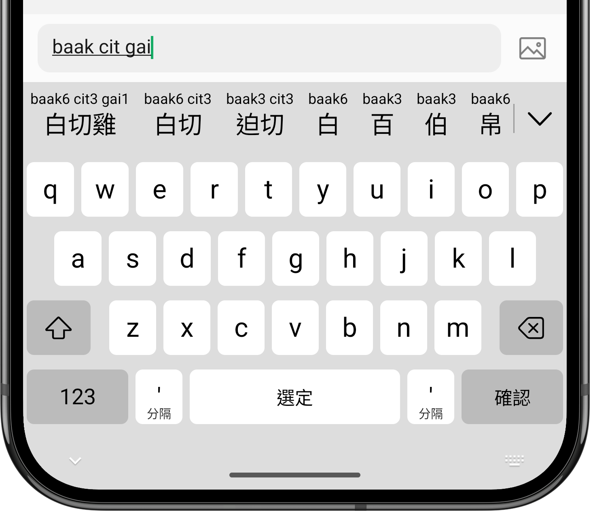

粵拼輸入法
======

 
 

Android 粵語拼音輸入法。

採用 [香港語言學學會粵語拼音方案](https://jyutping.org/jyutping) (粵拼 / Jyutping)，兼容各種習慣拼寫串法。  
候選詞會標注對應嘅粵拼。支援簡、繁體漢字。  
可以用倉頡、速成、筆畫、普通話拼音、拆字等反查粵語拼音。

另有 iOS、iPadOS 及 macOS 版: [yuetyam/jyutping](https://github.com/yuetyam/jyutping)

## 下載安裝（Download）
請前往官網下載安裝: https://jyutping.app/android

## 擷屏（Screenshots）

## 鳴謝（Credits）
- [Rime-Cantonese](https://github.com/rime/rime-cantonese) (Cantonese Lexicon)
- [OpenCC](https://github.com/BYVoid/OpenCC) (Traditional-Simplified Character Conversion)
- [JetBrains](https://www.jetbrains.com/) (Licenses for Open Source Development)

## 多謝支持（Support this project）

 

 
 

